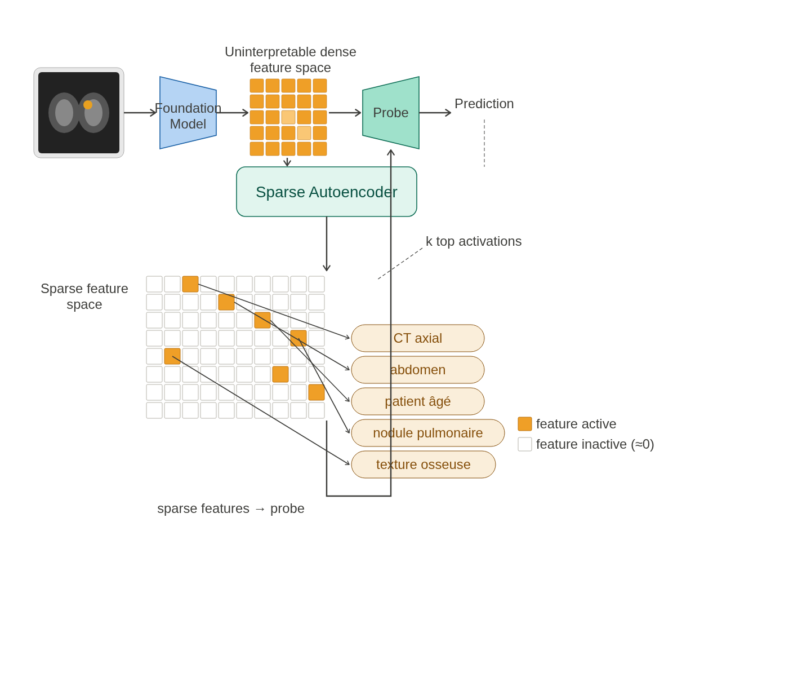
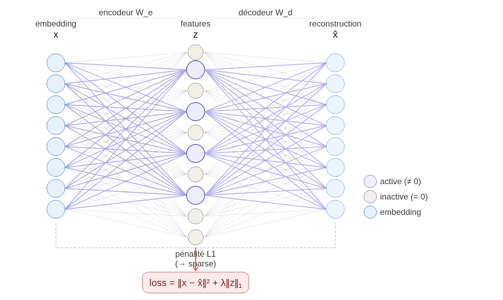
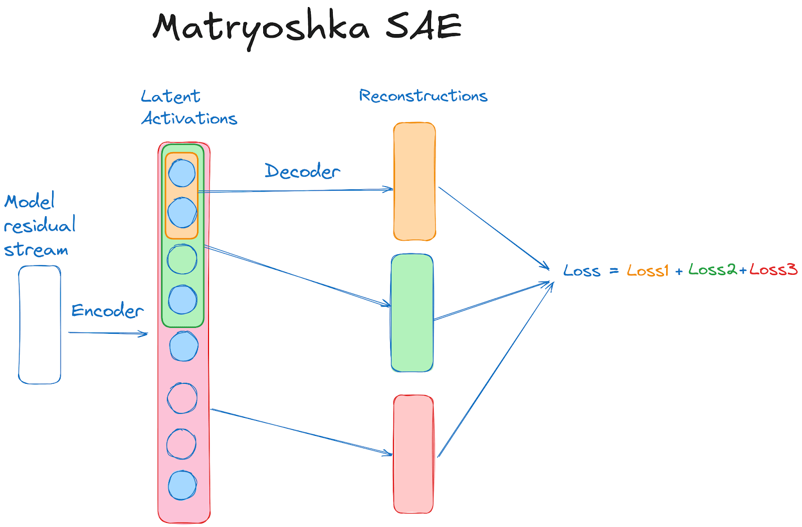
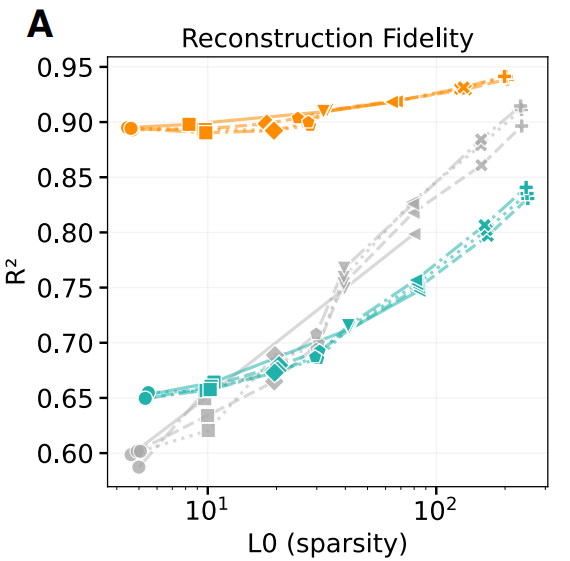
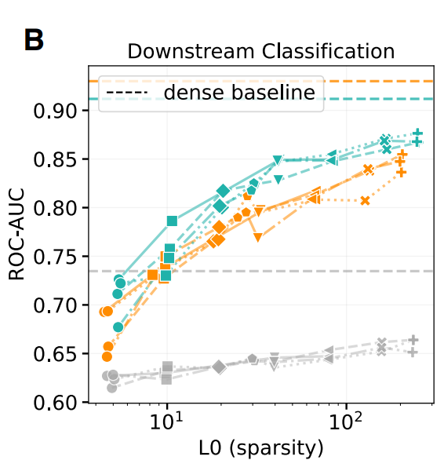

# Sparse Autoencoders for Interpretable Medical Image Representation Learning

**Wesp et al., arXiv:2603.23794, March 2026**

---

## Problem: Foundation models are opaque

- Models like **DINOv3** and **BiomedParse** encode images into dense vectors
- These vectors are powerful but **unreadable by clinicians**
- No one can inspect a 1024-dimensional float vector and reason about it

> Can we rewrite a dense medical embedding as a small set of interpretable concepts?

---

## The SAE pipeline

- The SAE sits **on top** of the foundation model
- Foundation model is **not modified**



---

## Foundation models used

| Model | Type | Embedding size |
|---|---|---|
| **BiomedParse** | Biomedical, domain-specific | 1536-dim |
| **DINOv3** | General-purpose vision | 1024-dim |
| **Random BiomedParse** | Untrained baseline | 1536-dim |

- All models are **frozen** during SAE training
- Random baseline tests: is it the architecture or the learned weights?

---

## What is a Sparse Autoencoder?

**Normal autoencoder:** compress → reconstruct

**Sparse autoencoder:** compress → reconstruct **using very few active features**



- Sparse = easier to inspect
- Goal: each active feature = one coherent concept

---

## Polysemantic vs monosemantic features

| | Polysemantic | Monosemantic |
|---|---|---|
| Activates for | Many unrelated things | One coherent concept |
| Interpretable? | No | Yes |
| Example | neuron fires for: knee X-ray, brain MRI, chest CT | neuron fires only for liver images |

SAEs are designed to push toward **monosemanticity**

---

## Architecture: Matryoshka SAE

- 4 nested dictionary levels (like Russian nesting dolls)
- Smaller levels are **prefixes** of larger ones
- Avantage : force les premiers features à capturer des concepts généraux, les suivants ajoutent les détails → moins de feature absorption, flexible à l'inférence



*Source : [Learning Multi-Level Features with Matryoshka SAEs][source].*

[source]: https://www.alignmentforum.org/posts/rKM9b6B2LqwSB5ToN/learning-multi-level-features-with-matryoshka-saes

---

## Sparsity: BatchTopK (training)

- Goal: keep only ~k active features per image
- **BatchTopK**: enforces average k across the batch, not exactly k per sample

```
k = 3, batch of 4 images → 12 total slots
  Sample 1: 5 features   (complex slice, many organs)
  Sample 2: 2 features   (simple/empty slice)
  Sample 3: 4 features
  Sample 4: 1 feature
```
$$
L_{BTK}(X) = \|X - (BatchTopK(W_{enc}X + b_{enc})W_{dec} + b_{dec})\|_2^2
$$
Why? Simple slices use fewer features, complex slices use more

---

## Sparsity: JumpReLU (inference)

- At inference: no batch → can't use BatchTopK
- **JumpReLU**: keep activation only if it exceeds a learned threshold

```
ReLU:     keep anything > 0
JumpReLU: keep only activations above threshold θ
```

- Threshold θ estimated during training from BatchTopK statistics

---

## Training objective
Because our Matryoshka architecture has 4 levels
$$
\mathcal{L}_{\text{total}}(X)
=
\frac{1}{4}
\sum_{\ell=1}^{4}
\mathcal{L}_{BTK}^{(\ell)}(X)
$$
---

## Dataset: TotalSegmentator

| | |
|---|---|
| Total scans | 1,844 (1,228 CT + 616 MRI) |
| Institutions | 10 |
| 2D slices | **909,873** |
| Metadata fields | 138 per image |

**Split (by institution, not by scan):**

| Split | % |
|---|---|
| Train | 68.6% |
| Validation | 17.3% |
| Test (3 withheld institutions) | 14.1% |

- Metadata includes: anatomy, imaging params, demographics

---

## Experiment overview

**96 SAE configurations** evaluated
- 3 foundation models
- 4 dictionary sizes : ([16, 64, 256, 1024] to [128, 512, 2048, 8192])
- 8  sparsity patterns (4 fixed, 4 progressive K)
- Best config family: `[128, 512, 2048, 8192]`

3 experiments:
1. SAE reconstruction & downstream quality
2. Configuration ranking (interpretability vs performance)
3. Feature interpretability

---

## Experiment 1: Reconstruction quality (R²)

*We check whether the SAE can faithfully reconstruct the original foundation model embedding.*

| Model | R² range |
|---|---|
| BiomedParse | 0.890 – **0.941** |
| DINOv3 | 0.649 – 0.841 |



> High R² ≠ interpretable features
> The random model reconstructs reasonably but fails downstream

---

## Experiment 1: Downstream performance (ROC-AUC)

*We check whether the sparse features retain enough semantic information to be useful on a real anatomical classification task.*




| Model | Dense AUC | Recovery |
|---|---|---|
| BiomedParse | 0.907 | **90.2%** |
| DINOv3 | 0.912 | **93.0%** |

> Random baseline best sparse AUC: 0.606–0.651


**With only 10 features:**

| Model | Recovery |
|---|---|
| BiomedParse | 87.8% |
| DINOv3 | 82.4% |

---

## Experiment 2: Best configurations monosemanticity/performance recovery

### Measuring monosemanticity

**Goal:** score each latent feature on whether it represents one clear concept.

$$M(f) = C(f) \times S(f)$$

**C(f) — Coherence**
- Take the top-10 images that activate feature $f$ most strongly
- Compute pairwise Jaccard similarity between their organ label sets
- *Null-adjusted*: subtract the similarity expected by chance (corrects for organs that appear in almost every image)

$$J(A,B) = \frac{|A \cap B|}{|A \cup B|}$$

High C(f) → the feature consistently fires on anatomically similar images

**S(f) — Specificity**
- Measure how concentrated the feature's activations are over organ labels
- Use inverse entropy: low entropy = focused on few labels = high specificity

> **Example:** Feature A fires on [liver: 90%, spleen: 8%, kidney: 2%] → H ≈ 0.35 (low) → high S(f)
> Feature B fires on [liver: 34%, lung: 33%, kidney: 33%] → H ≈ 1.58 (max) → low S(f)

High S(f) → the feature is locked onto a precise concept, not spread across everything


**M_config** = mean M(f) over the top-10 most monosemantic features of a configuration

---
### Best configurations

**BiomedParse best config:**
- Dict: `[128, 512, 2048, 8192]`, TopK: `[20, 40, 80, 160]`
- Mono rank: 2 / Perf rank: 3 → **Combined rank: 1**

**DINOv3 best config:**
- Dict: `[128, 512, 2048, 8192]`, TopK: `[5, 10, 20, 40]`
- Mono rank: 1 / Perf rank: 11 → **Combined rank: 1**

> More sparsity → cleaner features, but lower performance

---

## Experiment 3a: Sparse fingerprint retrieval

A **sparse fingerprint** = top-k active features + values for one image

| k | BiomedParse | DINOv3 |
|---|---|---|
| 1 | 0.929 | 0.752 | 
| 5 | **0.954** | **0.831** | 
| 10 | 0.964 | 0.852 |
| Dense | 0.976 | 0.895 |

At k=5:
- BiomedParse → **97.7%** of dense retrieval quality
- DINOv3 → **92.8%** of dense retrieval quality

---

## Experiment 3b: Automated feature interpretation

For each of the **top 250 most monosemantic features:**

1. Take top-20 activating images
2. Select 5 most dissimilar among them
3. Send to **MedGemma 27B** with metadata
4. Generate natural-language description

Example output:
> *"Axial CT of the abdomen and retroperitoneum in elderly patients"*

---

## Experiment 3c: VLM-as-judge validation

- 2nd MedGemma 27B model acts as judge
- Sees the feature's images + 5 descriptions (1 true, 4 distractors)
- Must rank which description fits best

| Model | Mean rank | Rank 1 (out of 250) |
|---|---|---|
| **DINOv3** | **1.60** | **170** |
| BiomedParse | 1.91 | 141 |

DINOv3 features are **more often described correctly**

---

## Experiment 3d: Language-driven retrieval

**Query:** *"Axial CT of the abdomen and retroperitoneum in an elderly patient"*

```
Text query
  → LLM selects matching feature descriptions
      → Assemble sparse fingerprint
          → Retrieve images by cosine similarity
```

| Model | Result |
|---|---|
| DINOv3 | Retrieves correct axial abdominal CT images |
| BiomedParse | Retrieves mixed MRI/CT thoracic images |

Zero-shot — no task-specific training

---

## Key metrics at a glance

| Metric | What it measures |
|---|---|
| R² | Reconstruction fidelity |
| ROC-AUC | Downstream classification performance |
| L0 | Number of active features (sparsity) |
| Coherence C(f) | Top activating images share similar organs? |
| Specificity S(f) | Feature concentrated on few organs? |
| Monosemanticity M(f) | C(f) × S(f) |
| VLM judge rank | Do descriptions match features? |

---

## DINOv3 vs BiomedParse: the surprising result

| | BiomedParse | DINOv3 |
|---|---|---|
| Domain | Biomedical | General vision |
| R² | **Higher** | Lower |
| Monosemanticity | 0.036–0.394 | **0.356–0.714** |
| VLM judge rank | 1.91 | **1.60** |
| Language retrieval | Mixed | **Correct** |

> Domain-specific pretraining ≠ more interpretable features
> General visual richness may matter more for clean factorization

---

## Limitations

- **No pathology** — TotalSegmentator is normal anatomy only
- **2D slices** — not volumetric, misses 3D context
- **Organ labels as proxy** — monosemanticity measured with metadata, not expert annotation
- **No radiologist validation** — interpretability judged by VLMs only
- **Single retrieval query** — language-driven retrieval is proof-of-concept
- **Interpretability–performance trade-off** — sparsest features lose task signal

---

## Takeaways

1. SAEs can convert opaque medical embeddings into **sparse, language-describable features**
2. **5–10 features** preserve most retrieval and downstream performance
3. DINOv3 (general) beats BiomedParse (biomedical) on interpretability
4. Automatic VLM pipeline is scalable but not a substitute for clinical validation
5. Promising direction: **text query → sparse features → image retrieval**

> Instead of asking clinicians to trust dense vectors,
> SAEs let medical AI expose the concepts it is using.
