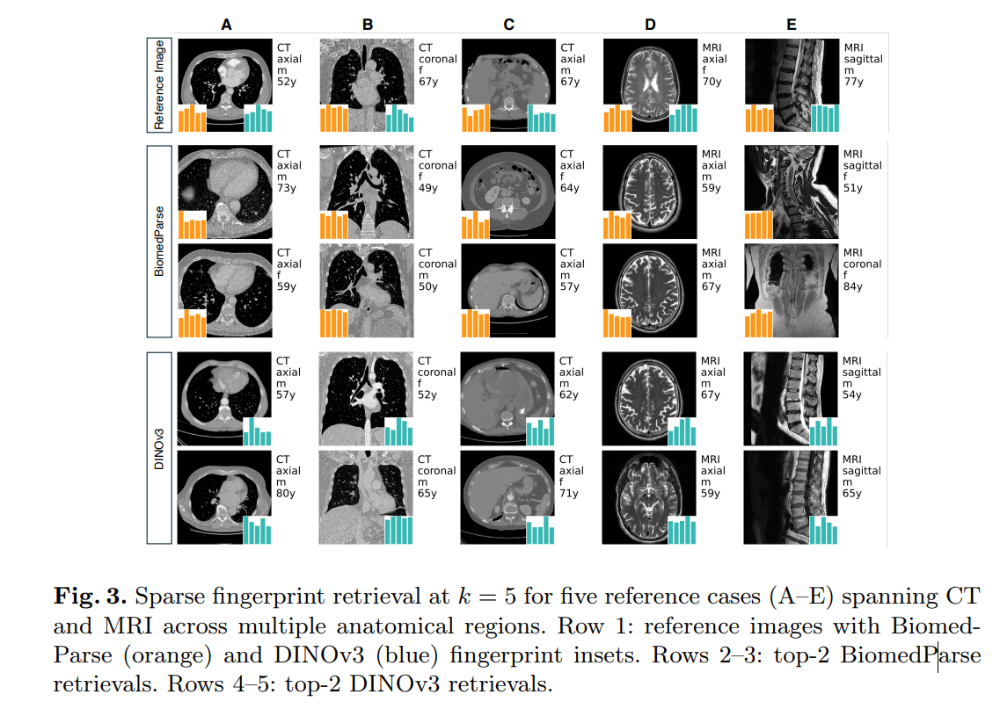
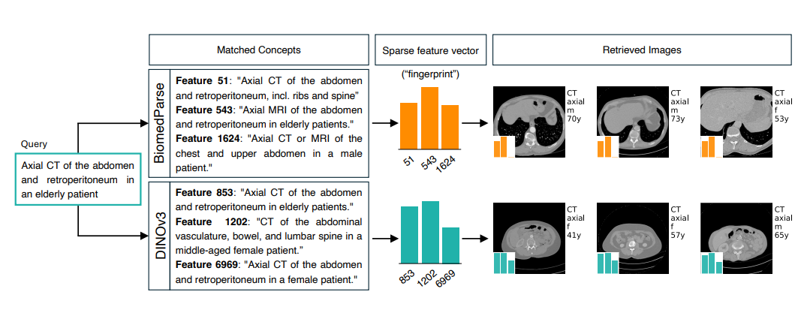

<!-- IMAGE_WIDTH: 600 -->

# Sparse Autoencoders for Interpretable Medical Image Representation Learning

**Wesp et al., arXiv:2603.23794, March 2026**

---

## Problem: Foundation models are opaque

- Models like **DINOv3** and **BiomedParse** encode images into dense vectors
- These vectors are powerful but **unreadable by clinicians**
- No one can inspect a 1024-dimensional float vector and reason about it

> Can we rewrite a dense medical embedding as a small set of interpretable concepts?

---

## The SAE pipeline

- The SAE sits **on top** of the foundation model
- Foundation model is **not modified**


---

## Foundation models used

| Model | Type | Embedding size |
|---|---|---|
| **BiomedParse** | Biomedical, domain-specific | 1536-dim |
| **DINOv3** | General-purpose vision | 1024-dim |
| **Random BiomedParse** | Untrained baseline | 1536-dim |

- All models are **frozen** during SAE training
- Random baseline tests: is it the architecture or the learned weights?

---

## What is a Sparse Autoencoder?

**Normal autoencoder:** compress → reconstruct

**Sparse autoencoder:** compress → reconstruct **using very few active features**


- Sparse = easier to inspect
- Goal: each active feature = one coherent concept

---

## Polysemantic vs monosemantic features

| | Polysemantic | Monosemantic |
|---|---|---|
| Activates for | Many unrelated things | One coherent concept |
| Interpretable? | No | Yes |
| Example | neuron fires for: knee X-ray, brain MRI, chest CT | neuron fires only for liver images |

SAEs are designed to push toward **monosemanticity**

---

## Architecture: Matryoshka SAE

- 4 nested dictionary levels (like Russian nesting dolls)
- Smaller levels are **prefixes** of larger ones
- Avantage : force les premiers features à capturer des concepts généraux, les suivants ajoutent les détails → moins de feature absorption, flexible à l'inférence


*Source : [Learning Multi-Level Features with Matryoshka SAEs][source].*

[source]: https://www.alignmentforum.org/posts/rKM9b6B2LqwSB5ToN/learning-multi-level-features-with-matryoshka-saes

---

## Sparsity: BatchTopK (training)

- Goal: keep only ~k active features per image
- **BatchTopK**: enforces average k across the batch, not exactly k per sample

```
k = 3, batch of 4 images → 12 total slots
  Sample 1: 5 features   (complex slice, many organs)
  Sample 2: 2 features   (simple/empty slice)
  Sample 3: 4 features
  Sample 4: 1 feature
```
$$
L_{BTK}(X) = \|X - (BatchTopK(W_{enc}X + b_{enc})W_{dec} + b_{dec})\|_2^2
$$
Why? Simple slices use fewer features, complex slices use more

---

## Sparsity: JumpReLU (inference)

- At inference: no batch → can't use BatchTopK
- **JumpReLU**: keep activation only if it exceeds a learned threshold

```
ReLU:     keep anything > 0
JumpReLU: keep only activations above threshold θ
```

- Threshold θ estimated during training from BatchTopK statistics

---

## Training objective
Because our Matryoshka architecture has 4 levels
$$
\mathcal{L}_{\text{total}}(X)
=
\frac{1}{4}
\sum_{\ell=1}^{4}
\mathcal{L}_{BTK}^{(\ell)}(X)
$$
---

## Dataset: TotalSegmentator

| | |
|---|---|
| Total scans | 1,844 (1,228 CT + 616 MRI) |
| Institutions | 10 |
| 2D slices | **909,873** |
| Metadata fields | 138 per image |

**Split (by institution, not by scan):**

| Split | % |
|---|---|
| Train | 68.6% |
| Validation | 17.3% |
| Test (3 withheld institutions) | 14.1% |

- Metadata includes: anatomy, imaging params, demographics

---

## Experiment overview

**96 SAE configurations** evaluated
- 3 foundation models
- 4 dictionary sizes : ([16, 64, 256, 1024] to [128, 512, 2048, 8192])
- 8  sparsity patterns (4 fixed, 4 progressive K)


3 experiments:
1. SAE reconstruction & downstream quality
2. Configuration ranking (interpretability vs performance)
3. Feature interpretability

---

## Experiment 1: Reconstruction quality (R²)

*We check whether the SAE can faithfully reconstruct the original foundation model embedding.*

| Model | R² range |
|---|---|
| BiomedParse | 0.890 – **0.941** |
| DINOv3 | 0.649 – 0.841 |


> High R² ≠ interpretable features
> The random model reconstructs reasonably but fails downstream

---

## Experiment 1: Downstream performance (ROC-AUC)

*We check whether the sparse features retain enough semantic information to be useful on a real anatomical classification task.*


| Model | Dense AUC | Recovery |
|---|---|---|
| BiomedParse | 0.907 | **90.2%** |
| DINOv3 | 0.912 | **93.0%** |

> Random baseline best sparse AUC: 0.606–0.651


---

## Experiment 2: Best configurations monosemanticity/performance recovery

### Measuring monosemanticity

**Goal:** score each latent feature on whether it represents one clear concept.

$$M(f) = C(f) \times S(f)$$

**C(f) — Coherence**
- Take the top-10 images that activate feature $f$ most strongly
- Compute pairwise Jaccard similarity between their organ label sets
- *Null-adjusted*: subtract the similarity expected by chance (corrects for organs that appear in almost every image)

$$J(A,B) = \frac{|A \cap B|}{|A \cup B|}$$

High C(f) → the feature consistently fires on anatomically similar images

**S(f) — Specificity**
- Measure how concentrated the feature's activations are over organ labels
- Use inverse entropy: low entropy = focused on few labels = high specificity

> **Example:** Feature A fires on [liver: 90%, spleen: 8%, kidney: 2%] → H ≈ 0.35 (low) → high S(f)
> Feature B fires on [liver: 34%, lung: 33%, kidney: 33%] → H ≈ 1.58 (max) → low S(f)

High S(f) → the feature is locked onto a precise concept, not spread across everything


**M_config** = mean M(f) over the top-10 most monosemantic features of a configuration

---
### Best configurations

**BiomedParse best config:**
- Dict: `[128, 512, 2048, 8192]`, TopK: `[20, 40, 80, 160]`
- Mono rank: 2 / Perf rank: 3 → **Combined rank: 1**

**DINOv3 best config:**
- Dict: `[128, 512, 2048, 8192]`, TopK: `[5, 10, 20, 40]`
- Mono rank: 1 / Perf rank: 11 → **Combined rank: 1**

> More sparsity → cleaner features, but lower performance

---

## Experiment 3a: Sparse fingerprint retrieval

**What is tested:**
1. The **fingerprint** keeps only the top-k active features + their values
2. Find the 5 images with the most similar sparse fingerprints (cosine similarity)
3. **Metric:** compare the retrieved images against those from the full dense embedding (cosine similarity)
4. This process is done with 1000 images

> Dense retrieval = upper bound (perfect score); sparse fingerprint aims to match it with far fewer features



| k | BiomedParse | DINOv3 |
|---|---|---|
| 1 | 0.929 | 0.752 | 
| 5 | **0.954** | **0.831** | 
| 10 | 0.964 | 0.852 |
| Dense | 0.976 | 0.895 |

At k=5:
- BiomedParse → **97.7%** of dense retrieval quality
- DINOv3 → **92.8%** of dense retrieval quality

---

## Experiments 3b: Interpretable sparse feature concepts

**Goal:** verify that each sparse feature corresponds to a real, human-readable medical concept — not just a random mathematical dimension.

**Step 1 — Pick the cleanest features**
Select the **top 250 most monosemantic** (mconfig)

**Step 2 — Find their most activating images**
For each feature, retrieve the top-20 images where it fires strongest, then keep the **5 most visually dissimilar** to avoid redundancy.

**Step 3 — Generate a description (MedGemma 27B)**
Send those 5 images + metadata (modality, orientation, anatomy, demographics) to a medical VLM. It outputs one natural-language phrase:
> *"Axial CT of the abdomen and retroperitoneum in elderly patients"*

**Step 4 — Validate with an independent judge**
A second MedGemma 27B model sees the same images + **5 candidate descriptions** (1 true, 4 distractors from other features) and ranks them. If the true description lands at rank 1, the feature is well-described.

| Model | Mean rank ↓ | Rank 1 | Rank 2 | Rank 3 | Rank 4 | Rank 5 |
|---|---|---|---|---|---|---|
| **DINOv3** | **1.60** | **170** | **38** | **21** | **13** | **8** |
| BiomedParse | 1.91 | 141 | 44 | 28 | 20 | 17 |

**DINOv3 features are more interpretable** — in 170/250 cases the judge correctly identified the true description as the best match.

---

## Experiment 3c: Language-driven retrieval

**Goal:** retrieve medical images from a plain-text clinical query — no reference image, no task-specific training, no CLIP-style model.

**Step 1 — Each sparse feature already has a label**
From Exp. 3b, every feature has a natural-language description:
> Feature 853: *"Axial CT of the abdomen and retroperitoneum in elderly patients"*
> Feature 1202: *"CT of the abdominal vasculature, bowel, and lumbar spine"*

Each feature is effectively a medical keyword.

**Step 2 — User writes a clinical query**
> *"Axial CT of the abdomen and retroperitoneum in an elderly patient"*

**Step 3 — LLM maps the query to matching features**
An LLM reads the query + all feature descriptions and selects the best matches (e.g. features 853, 1202, 6969). No image involved yet.

**Step 4 — Assemble a synthetic sparse fingerprint**
The selected features are weighted and assembled into a sparse vector — built entirely from text, but living in the same space as image fingerprints.

**Step 5 — Retrieve by cosine similarity**
That text fingerprint is compared against all image fingerprints → closest images are returned.




| Model | Feature quality | Retrieval result |
|---|---|---|
| **DINOv3** | Clean, specific concepts (*axial CT abdomen*) | Correct axial abdominal CTs |
| BiomedParse | Mixed concepts (*CT or MRI, thorax + abdomen*) | Mixed thoracic/abdominal images |
---

## Limitations

- **No pathology** — TotalSegmentator is normal anatomy only
- **2D slices** — not volumetric, misses 3D context
- **Organ labels as approximation** — monosemanticity measured with metadata, not expert annotation
- **Limited clinical semantic depth** — learned concepts mainly capture anatomy and modality rather than complex pathology or reasoning.
- **Single retrieval query** — language-driven retrieval is proof-of-concept and tested on large-scale benchmark

---

## Takeaways

1. Foundation models naturally learn anatomy, modality, and orientation concepts even without explicit anatomical supervision. 
2. SAEs can convert opaque medical embeddings into **sparse, language-describable features** without modifying or retraining the original foundation model.
3. **5–10 features** preserve most retrieval and downstream performance
4. DINOv3 (general) beats BiomedParse (biomedical) on interpretability (representational richness matters more than domain alignment)
5. Sparse features enable zero-shot language-driven image retrieval without requiring a reference image

