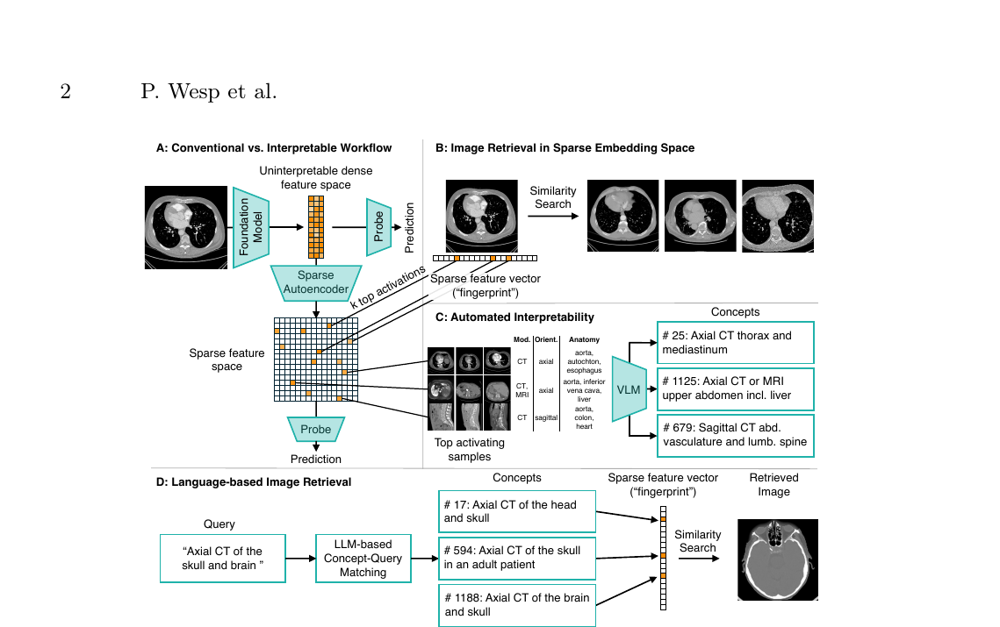
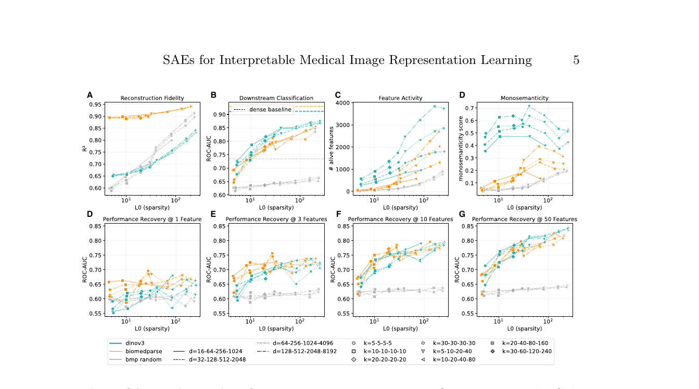
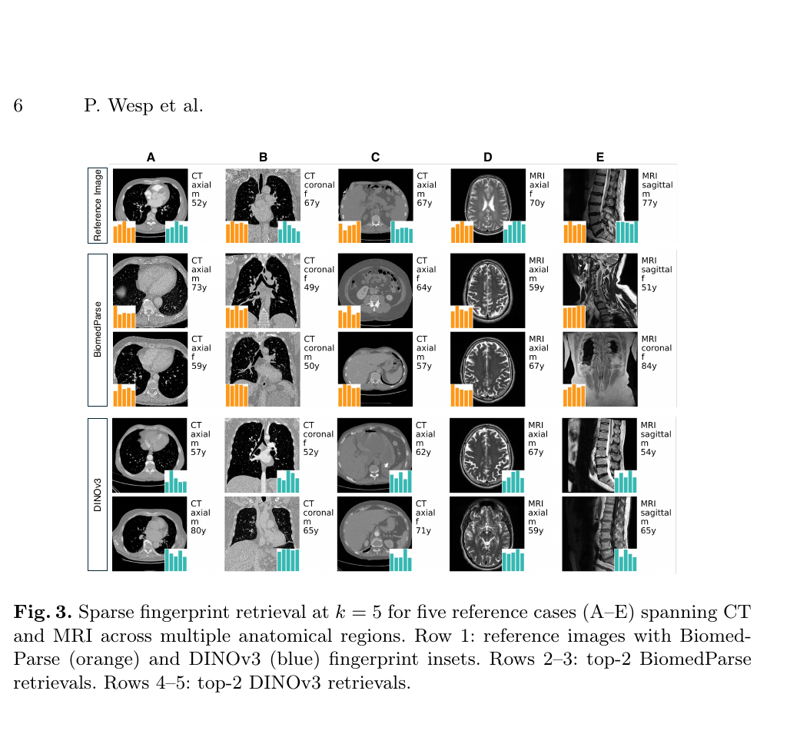
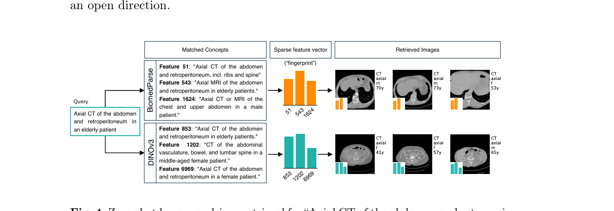

# Sparse Autoencoders for Interpretable Medical Image Representation Learning

**Reference:** Philipp Wesp, Robbie Holland, Vasiliki Sideri-Lampretsa, Sergios Gatidis. *Sparse Autoencoders for Interpretable Medical Image Representation Learning*. arXiv:2603.23794v1 (March 2026).
**Code:** <https://github.com/pwesp/sail>

**Table of Contents**

- [Highlights](#highlights)
- [1. Introduction](#1-introduction)
- [2. Methods](#2-methods)
  * [2.1 Background — what an SAE actually is](#21-background--what-an-sae-actually-is)
  * [2.2 Sparse Autoencoder architecture](#22-sparse-autoencoder-architecture)
    + [Matryoshka SAE](#matryoshka-sae)
    + [BatchTopK sparsification](#batchtopk-sparsification)
    + [JumpReLU at inference](#jumprelu-at-inference)
    + [Training objective](#training-objective)
  * [2.3 Monosemanticity scoring](#23-monosemanticity-scoring)
  * [2.4 Interpretability evaluation pipeline](#24-interpretability-evaluation-pipeline)
- [3. Experiments & Results](#3-experiments--results)
  * [Dataset and setup](#dataset-and-setup)
  * [3.1 SAE quality](#31-sae-quality)
  * [3.2 SAE configuration ranking](#32-sae-configuration-ranking)
  * [3.3 Sparse feature interpretability](#33-sparse-feature-interpretability)
- [4. Conclusion](#4-conclusion)
- [Limitations](#limitations)
- [Glossary of metrics](#glossary-of-metrics)

> **Highlights:**
>
> - First systematic study of **Sparse Autoencoders (SAEs)** on medical *vision* foundation models, extending prior chest X-ray work to **multi-modal CT/MRI** and to **two architecturally distinct FMs** (BiomedParse, DINOv3).
> - Trained on frozen embeddings of **909,873** 2D slices from TotalSegmentator (10 institutions, 3 held out as test).
> - Sparse features faithfully reconstruct dense embeddings (**R² up to 0.941**).
> - **10 sparse features recover 87.8 %** of the dense ROC-AUC — a 99.4 % dimensionality reduction.
> - Five-feature **sparse fingerprints** preserve **97.7 %** of dense retrieval quality.
> - Features are **monosemantic** — they encode single concepts (modality, plane, anatomy, demographics) verifiable by an independent VLM judge.
> - Features can be **labelled in natural language** by a VLM and queried by clinical text — enabling **zero-shot language-driven image retrieval**.
> - Surprising finding: the **general-purpose** DINOv3 produces *more* monosemantic features than the biomedical-pretrained BiomedParse — representational richness > domain alignment.



*Figure 1 (paper). (A) An SAE replaces opaque dense FM embeddings with a sparse feature space; a probe can read either. (B) Sparse-fingerprint retrieval matches images by cosine similarity over the k top-activated features. (C) A VLM auto-generates a concept description for each feature from its top-activating images and metadata. (D) An LLM maps a clinical text query to matching feature concepts for zero-shot image retrieval.*

---

## 1. Introduction [#](#1-introduction)

Vision foundation models (FMs) achieve strong performance in medical imaging (segmentation, classification, retrieval) but encode information in **abstract, polysemantic** low-dimensional vectors. Clinical deployment, however, requires that physicians can **justify** a decision and **inspect** the reasoning — a misalignment with opaque latents.

**Mechanistic interpretability** aims to reverse-engineer such internals into human-understandable components. **Sparse Autoencoders (SAEs)** are a leading approach in LLMs: they decompose polysemantic activations into **monosemantic features** that each correspond to one coherent concept.

Prior work (Abdulaal et al., 2024) applied SAEs to **chest X-ray** embeddings of a single model, with paired text supervision for labelling. The open question this paper tackles:

> Do anatomical and clinical concepts emerge from **self-supervised** medical vision training **without explicit labels**, and can SAEs expose this structure **consistently across architecturally different FMs**?

The contribution is a study that:

1. Trains **Matryoshka SAEs with BatchTopK** on frozen embeddings of two FMs — **BiomedParse** (biomedical, 1536-dim) and **DINOv3** (general-purpose self-supervised ViT, 1024-dim) — plus a random-weight BiomedParse baseline to disentangle learned structure from architectural capacity.
2. Evaluates 96 SAE configurations per FM on **909,873** CT and MRI slices from TotalSegmentator.
3. Demonstrates **four properties** of the learned sparse features: faithful reconstruction, downstream-task utility from very few features, semantic-preserving retrieval, and language-bridgeable monosemanticity.

---

## 2. Methods [#](#2-methods)

The only optimised parameters are the SAE itself — the FM weights are **frozen**, the embeddings **precomputed**.

### 2.1 Background — what an SAE actually is [#](#21-background--what-an-sae-actually-is)

A **Sparse Autoencoder** is a single-hidden-layer autoencoder with two key constraints:

- The hidden layer is **wider** than the input (over-complete, dictionary-style) — typically 8×–32× the input dimension.
- Only a small number of hidden units fire per sample (sparsity), enforced explicitly via a top-k operator or implicitly via an L1 penalty.

Formally, given an input embedding \(x \in \mathbb{R}^d\):

```
encoder:    z = σ(W_enc · x + b_enc)        (z ∈ R^D, D >> d)
sparsify:   ẑ = TopK(z, k)                  (only k entries non-zero)
decoder:    x̂ = W_dec · ẑ                   (W_dec usually = W_encᵀ)
```

The decoder columns can be interpreted as a **dictionary**, where each column is a "feature direction" in embedding space. Sparsity forces the network to allocate **one direction per coherent concept** rather than smearing concepts across many neurons (the *superposition* phenomenon described by Elhage et al., 2022).

If the SAE is well-trained, each non-zero entry of \(\hat z\) becomes a **monosemantic** indicator: it lights up for one concept (e.g. *axial CT of the abdomen*) and stays dark otherwise.

### 2.2 Sparse Autoencoder architecture [#](#22-sparse-autoencoder-architecture)

The authors adopt the **Matryoshka SAE** with **BatchTopK** sparsification at training time and **JumpReLU** thresholding at inference. Together these address three classical SAE failure modes (rigid dictionary size, fixed per-sample sparsity, train/test mismatch).

#### Matryoshka SAE [#](#matryoshka-sae)

The dictionary is built as **\(L = 4\) nested levels** of increasing size \([D_1, D_2, D_3, D_4]\), e.g. \([128, 512, 2048, 8192]\). The Matryoshka idea (Bussmann et al., 2025) is that a **single shared encoder** projects to \(D_4\) pre-activation codes, and level \(\ell\) is obtained by simply taking the **first \(D_\ell\) codes as a prefix subset**:

```
                shared encoder  E
   x ────────────────────────────────────► z ∈ R^{D_4}    (pre-activations)
                                            │
       prefix-1 ──► z[:D_1] ──► decode ──► x̂_1   (coarsest)
       prefix-2 ──► z[:D_2] ──► decode ──► x̂_2
       prefix-3 ──► z[:D_3] ──► decode ──► x̂_3
       prefix-4 ──► z[:D_4] ──► decode ──► x̂_4   (finest)
```

A single shared decoder (\(W_{dec} = W_{enc}^\top\), columns normalised to unit norm) reconstructs each level by zero-padding the smaller-level activations. Effects:

- **Early levels** are forced to capture the **coarse, broadly useful** structure (modality, gross anatomy).
- **Later levels** progressively **refine** with finer concepts.
- The same model serves multiple sparsity / dictionary-size operating points without retraining — important for the 96-configuration sweep that follows.

#### BatchTopK sparsification [#](#batchtopk-sparsification)

Standard TopK keeps the top \(k\) activations **per sample**. **BatchTopK** (Bussmann et al., 2024) instead keeps the top \(k \times B\) activations across an entire batch of size \(B\), so that **\(k\) features are active per sample on average** but the allocation is flexible:

- A "complex" image (lots of anatomy in view) can use, say, 25 features.
- A "simple" image (homogeneous region) might use only 4.

This avoids forcing every sample to use exactly \(k\) features whether it needs them or not.

#### JumpReLU at inference [#](#jumprelu-at-inference)

BatchTopK is fine for training but is **batch-dependent** — bad at inference where you process one image at a time. The trick (Rajamanoharan et al., 2024) is to swap BatchTopK for **JumpReLU** at inference:

\[
\text{JumpReLU}_\tau(z) = z \cdot \mathbb{1}[z > \tau]
\]

i.e. a hard threshold: pre-activations above \(\tau\) pass through unchanged, below \(\tau\) become zero. The threshold \(\tau\) is estimated **during training** as a running average of the minimum kept activation under BatchTopK. Result: the inference-time sparsity matches what the model saw during training, with **no auxiliary L1 penalty** anywhere.

#### Training objective [#](#training-objective)

The loss is simply the **mean squared error** between input and reconstruction, **averaged across all \(L\) Matryoshka levels**:

\[
\mathcal{L} = \frac{1}{L} \sum_{\ell=1}^{L} \| x - \hat x_\ell \|_2^2
\]

There are **no auxiliary sparsity or diversity penalties** — sparsity is structural (BatchTopK / JumpReLU), not regularised.

### 2.3 Monosemanticity scoring [#](#23-monosemanticity-scoring)

To compare configurations beyond reconstruction error, each individual feature \(f\) is scored as

\[
M(f) = C(f) \times S(f)
\]

where:

- **Coherence \(C(f)\)** — null-adjusted mean **pairwise Jaccard similarity** of the *organ sets* of the feature's **top-10 activating samples**. If all 10 top images contain the same organs, \(C(f)\) is high; if the top images share no organs, low. *Null-adjusted* means subtracting the expected Jaccard under a random baseline so that the score reflects genuine clustering, not base-rate artefacts.
- **Specificity \(S(f)\)** — normalised **inverse entropy** of the organ label distribution over the activating samples. If the feature is selective (almost always activates on, say, "kidney"), entropy is low → \(S(f)\) high; if it activates on a mish-mash, \(S(f)\) low.

The **configuration-level score** is

\[
M_{\text{config}} = \frac{1}{10}\sum_{f \in \text{top-10 features}} M(f)
\]

i.e. the mean monosemanticity of the configuration's 10 best features. This avoids reward-hacking by configurations with one perfect feature and 8000 random ones.

### 2.4 Interpretability evaluation pipeline [#](#24-interpretability-evaluation-pipeline)

Three complementary demonstrations are run on the **selected optimal configurations** (one per FM):

**(a) Sparse Fingerprint Retrieval.** A *fingerprint* is the \(k\) most activated features (indices + values) per image. Retrieval is by **cosine similarity over fingerprints**. Quality is measured as the **mean cosine similarity to the reference image in the dense embedding space** (i.e. a proxy: even if you retrieve via the sparse code, do you land near the reference *in the original FM space*?). Dense retrieval is the upper bound.

**(b) Automated Feature Interpretation.** For the **top-250** features by \(M(f)\):

1. Greedily select the **5 most dissimilar** images (by cosine) from the **top-20** activating samples — diverse positive examples.
2. Prompt **MedGemma 27B** (a medical VLM) with those 5 images + their metadata (modality, orientation, anatomy, demographics) to generate a **natural-language concept description**.
3. **LLM-as-judge**: a *separate* MedGemma 27B receives the same 5 images and **5 candidate descriptions** — 1 true, 4 distractors drawn from other features — and ranks them. The **rank of the true description** (1 = best, 5 = worst) quantifies interpretability.

**(c) Language-Driven Image Retrieval.** Given a **clinical text query**, an LLM picks the matching feature descriptions, **assembles a sparse fingerprint** from their mean activations, and runs cosine retrieval — **no reference image, no task-specific training**.

```
                Pipeline (paper Fig. 1)
                ─────────────────────────────────────────
  Image  ─►  Frozen FM  ─►  dense embedding  ─►  SAE encoder
                                                     │
                                                BatchTopK / JumpReLU
                                                     │
                                              sparse fingerprint
                                                     │
                ┌────────────────────────┬───────────┴──────────────┐
                │                        │                          │
       (a) cosine similarity     (b) VLM auto-          (c) LLM picks features
           over fingerprints         label features            from text query
           → image retrieval        → concept text          → fingerprint → retrieval
```

---

## 3. Experiments & Results [#](#3-experiments--results)

### Dataset and setup [#](#dataset-and-setup)

- **TotalSegmentator** — 1,844 scans (1,228 CT, 616 MRI) from **10 institutions** → **909,873** 2D slices with **138 per-image metadata fields** (anatomy presence, imaging parameters, demographics).
- **Splits.** 3 institutions (14.1 % of slices) are **withheld as test set**. The remaining 7 institutions are split 80 / 20 train / val, **stratified by modality, age group, and sex** (68.6 % / 17.3 %).
- **Optimisation.** Adam, lr = \(10^{-4}\) with cosine annealing to \(10^{-6}\), 100 epochs, batch size 2048.
- **Configuration sweep.** **96 configurations per FM** = 4 dictionary-size families (from \([16, 64, 256, 1024]\) up to \([128, 512, 2048, 8192]\)) × 8 sparsity patterns (4 fixed-K, 4 progressive-K).
- **Baselines.** (i) Full dense embedding (upper bound). (ii) **Random-weight BiomedParse** — same architecture, weights never trained — to isolate the contribution of *learned* representational structure from architectural capacity.

### 3.1 SAE quality [#](#31-sae-quality)



*Figure 2 (paper). 96 SAE configurations per FM. DINOv3 in blue, BiomedParse in orange, random-weight baseline in grey. (A) Reconstruction R² vs. L0 sparsity. (B) Downstream ROC-AUC vs. L0. (C) Number of "alive" features (features that activate on at least one test sample). (D) Monosemanticity score. (E–G) ROC-AUC achievable using only the top-1, top-3, top-10, top-50 features.*

Two metrics dominate the panel:

- **R² (Reconstruction Fidelity)**:
  - BiomedParse: **0.890 – 0.941**
  - DINOv3: **0.649 – 0.841** (lower — DINOv3 embeddings are richer / harder to compress)
  - Random baseline: 0.587 – 0.915 (can match BiomedParse on R² alone — see below)

- **Downstream ROC-AUC** (a probe is trained on the sparse features for anatomical classification):
  - Dense BiomedParse: **0.907**, Dense DINOv3: **0.912**.
  - Best sparse: BiomedParse **0.818** (90.2 % recovery), DINOv3 **0.848** (93.0 % recovery).
  - **Random baseline only 0.606 – 0.651** despite a comparable R² range — confirming **R² alone is not a proxy for semantic utility**: a sparse code can faithfully reconstruct *random* embeddings while encoding nothing meaningful.

A subtler observation: **DINOv3 has lower R² than BiomedParse but higher downstream AUC**. Task-relevant structure can be preserved even under approximate reconstruction; conversely, perfect reconstruction of a meaningless space is meaningless.

### 3.2 SAE configuration ranking [#](#32-sae-configuration-ranking)

The two desiderata — **monosemanticity** and **performance recovery** — trade off against each other. Configurations are ranked on each axis and combined:

- **DINOv3** monosemanticity range: **0.356 – 0.714**
- **BiomedParse** monosemanticity range: 0.036 – 0.394
- **Random baseline**: 0.038 – 0.202

DINOv3 wins on monosemanticity *despite no biomedical pretraining*. The random baseline is far below both, again confirming that monosemanticity reflects *learned* structure, not architectural capacity.

| Model        | Dict. Sizes              | Top-K Values              | #Mono | #Perf | #Comb |
|--------------|--------------------------|---------------------------|:-----:|:-----:|:-----:|
| **BiomedParse** | **128, 512, 2048, 8192** | **20, 40, 80, 160**       |   2   |   3   | **1** |
|              | 128, 512, 2048, 8192     | 30, 60, 120, 240          |   3   |   6   |   2   |
|              | 128, 512, 2048, 8192     | 10, 20, 40, 80            |   1   |  12   |   3   |
| **DINOv3**   | **128, 512, 2048, 8192** | **5, 10, 20, 40**         |   1   |  11   | **1** |
|              | 64, 256, 1024, 4096      | 5, 10, 20, 40             |   4   |  10   |   2   |
|              | 128, 512, 2048, 8192     | 10, 20, 40, 80            |   2   |  14   |   3   |

*Top-3 configurations per FM (of 96), ranked by combined score. The **bold** rows are the selected optima used in §3.3. The dictionary family \([128, 512, 2048, 8192]\) wins both rankings — bigger Matryoshka dictionaries with progressive K patterns dominate.*

Note the trade-off: DINOv3's optimal config ranks **#1 on monosemanticity** but only **#11 on performance recovery** — sparser representations make individual features cleaner but reduce raw classification headroom.

**Performance recovery with very few features** (a key practical metric):
- With **N = 10** features, BiomedParse recovers **87.8 %** and DINOv3 **82.4 %** of dense ROC-AUC.
- Returns diminish past N = 10 → semantic content really does concentrate in a small handful of features.

### 3.3 Sparse feature interpretability [#](#33-sparse-feature-interpretability)

For the optimal configurations (random baseline excluded — no semantic structure to interpret).

#### (a) Sparse-fingerprint image retrieval

| Model        | k=1   | k=5   | k=10  | k=20  | Dense |
|--------------|:-----:|:-----:|:-----:|:-----:|:-----:|
| BiomedParse  | 0.929 | 0.954 | 0.964 | 0.967 | 0.976 |
| DINOv3       | 0.752 | 0.831 | 0.852 | 0.857 | 0.895 |

*Mean cosine similarity (in dense embedding space) of the top-5 retrieved images to the query, averaged over 1,000 test references. Quality saturates above k = 10 — meaning a 5–10-element fingerprint is enough for high-quality retrieval.*

At **k = 5**, BiomedParse achieves **97.7 %** of dense retrieval quality and DINOv3 **92.8 %**.



*Figure 3 (paper). Sparse-fingerprint retrieval at k = 5 for five reference cases (A–E) spanning CT and MRI across multiple anatomies. Row 1: reference image with the BiomedParse (orange) and DINOv3 (blue) fingerprint as inset. Rows 2–3: BiomedParse top-2 retrievals. Rows 4–5: DINOv3 top-2 retrievals. Both models retrieve modality- and anatomy-consistent neighbours from a 5-feature representation.*

#### (b) Automated feature interpretation (LLM-as-judge)

| Model        | Mean rank | Rank 1 | Rank 2 | Rank 3 | Rank 4 | Rank 5 |
|--------------|:---------:|:------:|:------:|:------:|:------:|:------:|
| BiomedParse  | 1.91      |  141   |   44   |   28   |   20   |   17   |
| DINOv3       | **1.60**  | **170**|   38   |   21   |   13   |    8   |

*Top-250 features per model. The independent VLM judge ranks the true VLM-generated description among 5 candidates. DINOv3 features are clearly more interpretable.*

The generated concept descriptions captured **modality, imaging plane, anatomy, and even demographics** — all emerging from **self-supervised** learning **without explicit anatomical labels**.

#### (c) Language-driven zero-shot retrieval



*Figure 4 (paper). Query: **"Axial CT of the abdomen and retroperitoneum in an elderly patient."** An LLM selects matching feature concepts (left), assembles the sparse fingerprint (centre), and the cosine retrieval returns images (right).*
*BiomedParse lacks a modality-pure abdomen feature → selects mixed MRI/CT concepts → retrieves thoracic images.*
*DINOv3 has three abdomen-CT-specific features → retrieves anatomically correct axial abdominal CT.*

This is the end-to-end demonstration: **clinical text → feature concepts → fingerprint → image retrieval**, with no reference image and no fine-tuning. The richer feature vocabulary of DINOv3 lets it succeed where BiomedParse fails on this query, reinforcing the §3.2 finding that representational richness > domain alignment.

---

## 4. Conclusion [#](#4-conclusion)

- Matryoshka SAEs with BatchTopK + JumpReLU faithfully **preserve embedding structure**, recover strong **downstream performance from a handful of features**, enable **semantic-preserving retrieval**, and bridge to **clinical natural language** in a zero-shot manner.
- Self-supervised vision FMs **implicitly encode anatomy-aligned structure** that SAEs can expose as language-describable sparse features. This holds **across two architecturally different FMs** and **across CT and MRI** — extending the prior single-modality, single-architecture chest-X-ray result.
- **Surprise:** general-purpose **DINOv3** outperforms biomedical-pretrained **BiomedParse** on every interpretability axis (monosemanticity, judge rank, language-retrieval correctness). **Representational richness matters more than domain alignment** for SAE interpretability.
- SAEs are a **practical interpretability layer**: no architectural change to the FM, no labels, no retraining of the FM itself.

## Limitations [#](#limitations)

- **Monosemanticity scoring uses metadata-derived organ labels and VLM-generated descriptions** rather than human annotation — scalable but a *proxy* for clinical interpretability.
- **No pathology.** TotalSegmentator covers normal anatomy across 10 institutions but excludes pathological cases.
- **2D slice-level analysis only** — not volumetric, which is the natural unit of much of clinical imaging.
- **Language-driven retrieval is shown on a single query.** Aggregate evaluation across a broader, structured query set (and in particular handling **demographic constraints**, where the demonstration was weakest) is left for future work.
- The 96-configuration sweep is per FM; transfer to other FMs (e.g. RadDINO, Med-SAM, MedSigLIP) is not tested.

---

## Glossary of metrics [#](#glossary-of-metrics)

| Metric | Definition | What it tells you |
|---|---|---|
| **R²** (Reconstruction Fidelity) | \(1 - \frac{\|x - \hat x\|^2}{\|x - \bar x\|^2}\) on dense embeddings | How accurately the SAE *reconstructs* the FM embedding. **Necessary but not sufficient.** |
| **L0 sparsity** | average # of non-zero entries per sample | Effective sparsity at inference (set by JumpReLU's \(\tau\)). |
| **Alive features** | # features that fire on ≥ 1 test sample | Capacity actually used; "dead" features waste dictionary slots. |
| **ROC-AUC** (downstream) | probe trained on sparse features, evaluated on anatomical classification | Whether the sparse code retains task-relevant information. |
| **Performance recovery @ N** | ROC-AUC using only the top-N features per sample | Concentration of information — how few features you need. |
| **Coherence \(C(f)\)** | null-adjusted mean pairwise Jaccard over organ sets of top-10 activating samples | Do a feature's top samples *agree* on which organs are present? |
| **Specificity \(S(f)\)** | normalised inverse entropy of the organ label distribution over activating samples | Does the feature *select* a narrow organ set rather than firing broadly? |
| **Monosemanticity \(M(f) = C(f)\cdot S(f)\)** | per-feature score | One coherent, specific concept = high \(M(f)\). |
| **\(M_{\text{config}}\)** | mean \(M(f)\) over the top-10 features | Configuration-level monosemanticity, robust to dictionary size. |
| **Fingerprint cosine similarity** | cosine over k top-activated features | Retrieval quality from sparse code (proxy: similarity *in dense space* between query and retrieved). |
| **LLM-as-judge rank** | rank assigned to the true VLM description among 5 candidates | End-to-end check that features are language-describable and distinguishable. |

---

*This review summarises the paper's content for study purposes. All figures are reproduced from the original paper (Wesp et al., arXiv:2603.23794v1) for illustrative discussion under fair-use academic review.*
